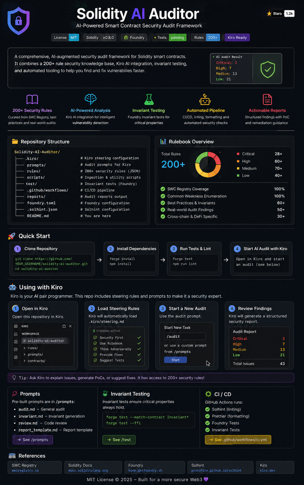

# Kiro Solidity Auditor Agent

Security-focused setup for using Kiro as a Solidity audit assistant with reusable rulebooks, steering, prompts, and ingestion tooling.

## Repository Layout

```text
.
├── findings/
│   ├── security_rules.json
│   ├── unclassified_findings.json
│   ├── raw_findings.json
│   └── synthesis_stats.json
├── .kiro/steering/
│   └── solidity-auditor.md
├── prompts/
│   ├── auditor.md
│   ├── triage.md
│   └── invariant.md
├── RULEBOOK_INDEX.md
├── INSTRUCTIONS.md
└── project-ingestion/
    └── project/
        ├── ingest.py
        └── scripts/synthesize_rules.py
```

## What This Is For

- Provide Kiro with a rulebook-backed security mindset.
- Reuse the same audit setup across multiple target repos.
- Keep audit artifacts out of production repos when desired.

## Quick Start

1. Read [INSTRUCTIONS.md](/home/ssubik/Documents/KIRO/ai_setup_final/ai_setup/INSTRUCTIONS.md).
2. Ensure Kiro has access to:
   - `findings/security_rules.json`
   - `findings/unclassified_findings.json`
   - `.kiro/steering/solidity-auditor.md`
3. Start with `prompts/auditor.md` for contract reviews.

## Canonical Pipeline

From `project-ingestion/`:

```bash
python3 -m project.ingest --output ../findings/raw_findings.json
python3 -m project.scripts.synthesize_rules \
  --input ../findings/raw_findings.json \
  --output ../findings/security_rules.json \
  --unclassified-output ../findings/unclassified_findings.json \
  --stats-output ../findings/synthesis_stats.json
```

## Notes

- The rulebooks are data products and require periodic curation.
- `findings/unclassified_findings.json` is intended for triage and promotion into curated rules.
